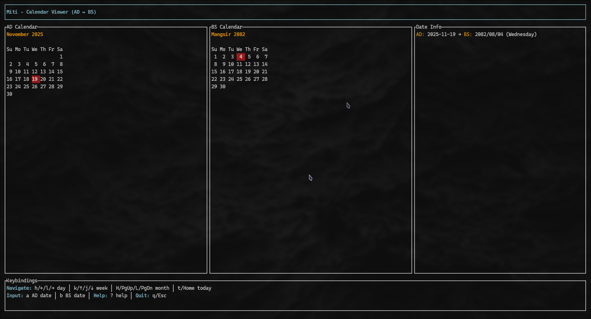

# Miti (मिति)

A beautiful terminal user interface (TUI) calendar viewer that displays both Gregorian (AD) and Nepali (BS/Bikram Sambat) calendars side-by-side with seamless conversion between the two systems.



## Features

- **Dual Calendar View**: View AD and BS calendars simultaneously
- **Bidirectional Conversion**: Accurate conversion between AD and BS dates (2000-2100 BS)
- **Vim-style Navigation**: Navigate using familiar vim keys or arrow keys
- **Date Input**: Jump to any date in either AD or BS format
- **Visual Indicators**:
  - 🔴 Red highlight for today's date
  - 🟢 Green highlight for selected date
- **Rich Date Information**:
  - Day of week in both English and Nepali (Devanagari)
  - Week number
  - Days difference from today
- **Help Screen**: Press `?` for complete keybindings reference
- **Clean UI**: Inspired by impala's minimalist design

## Installation

### From AUR (Arch Linux)

```bash
paru -S miti
# or
yay -S miti
```

### From crates.io

```bash
cargo install miti
```

### From Source

```bash
git clone https://github.com/saimon-dahal/miti
cd miti
cargo build --release
sudo cp target/release/miti /usr/local/bin/
```

## Usage

Simply run:

```bash
miti
```

### Keybindings

#### Navigation
- `h` / `←` - Move backward by 1 day
- `l` / `→` - Move forward by 1 day
- `k` / `↑` - Move backward by 1 week
- `j` / `↓` - Move forward by 1 week
- `H` / `PgUp` - Move backward by 1 month
- `L` / `PgDn` - Move forward by 1 month
- `t` / `Home` - Jump to today's date

#### Date Input
- `a` - Enter AD date (format: YYYY-MM-DD)
- `b` - Enter BS date (format: YYYY-MM-DD)

#### Other
- `?` - Show help screen
- `q` / `Esc` - Quit application


## Technical Details

### Supported Date Range
- **BS**: 2000 BS to 2100 BS
- **AD**: Approximately 1943 AD to 2043 AD

### Leap Year Handling
- AD dates use Chrono's built-in leap year calculation
- BS dates use a comprehensive lookup table with accurate month lengths

### Conversion Algorithm
The conversion uses a reference date (2000/01/01 BS = 1943/04/14 AD) and calculates the difference in days using the lookup table for accurate bidirectional conversion.

## Building

### Requirements
- Rust 1.70 or later
- Cargo

### Build Commands

```bash
# Debug build
cargo build

# Release build
cargo build --release

# Run tests
cargo test

# Run
cargo run
```

## Contributing

Contributions are welcome! Please feel free to submit a Pull Request.

## License

This project is licensed under the MIT License - see the [LICENSE](LICENSE) file for details.

## Acknowledgments

- Built with [ratatui](https://github.com/ratatui-org/ratatui)
- BS calendar data based on standard Nepali calendar mappings

## Author

Saimon Dahal - [@saimon-dahal](https://github.com/saimon-dahal)

## Support

If you find this project useful, please consider giving it a ⭐ on GitHub!
